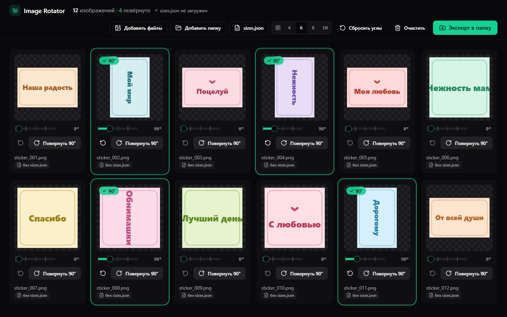

# Image Rotator



Маленькое десктопное приложение под Windows для пакетного поворота PNG-изображений с сохранением прозрачности.

Бросаете в окно файлы или целую папку, поворачиваете каждое изображение перетаскиваемой ручкой (со снапом к 0/90/180/270) и экспортируете обработанные копии в любую папку — нативно, без ZIP.

## Скачать

Готовые сборки лежат в [GitHub Releases](https://github.com/baslie/image-rotator/releases/latest):

- **`Image Rotator_0.1.0_x64-setup.exe`** — NSIS-инсталлятор, ~1.3 MB. Поставит приложение в `Program Files`, добавит ярлыки. На Windows 10 при необходимости подтянет WebView2.
- **`image-rotator.exe`** — портативный standalone, ~3.5 MB, запускается без установки. На Windows 11 WebView2 уже встроен.

## Стек

- **Tauri 2** — нативная Windows-оболочка (Rust + WebView2)
- **React 19 + TypeScript + Vite 8** — фронтенд
- **Tailwind v4 + shadcn/ui + Zustand** — UI и состояние
- **NSIS** — инсталлятор

## Сборка из исходников

Один раз поставить:

1. [MSVC C++ Build Tools](https://aka.ms/vs/17/release/vs_BuildTools.exe) — workload «Desktop development with C++» (MSVC v143 + Windows 11 SDK)
2. [Rust toolchain](https://rustup.rs)
3. Node.js 20+

Затем из `app/`:

```powershell
npm install
npm run tauri:dev      # окно с HMR
npm run tauri:build    # production-инсталлятор → app/src-tauri/target/release/bundle/nsis/
```

## Структура

- `app/` — фронтенд (React + Vite)
- `app/src-tauri/` — Rust-крейт `image-rotator`, `tauri.conf.json`, иконки, capabilities

## Лицензия

MIT
